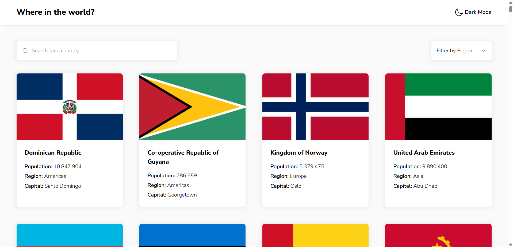
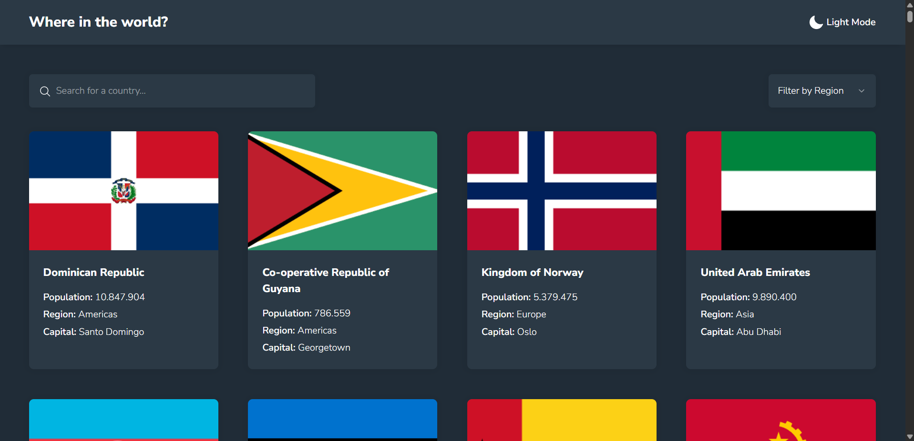
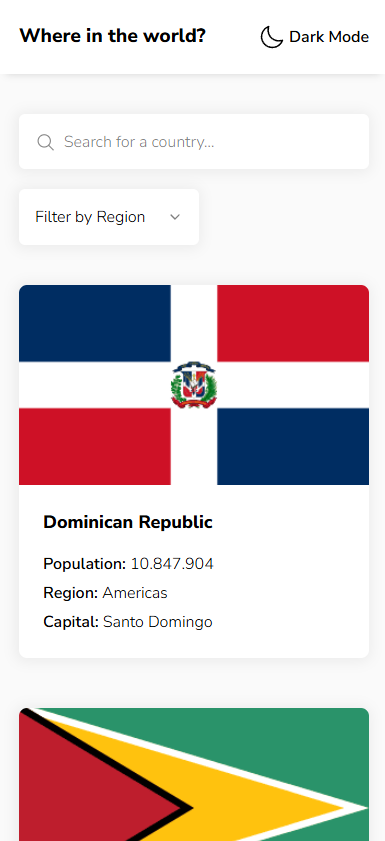
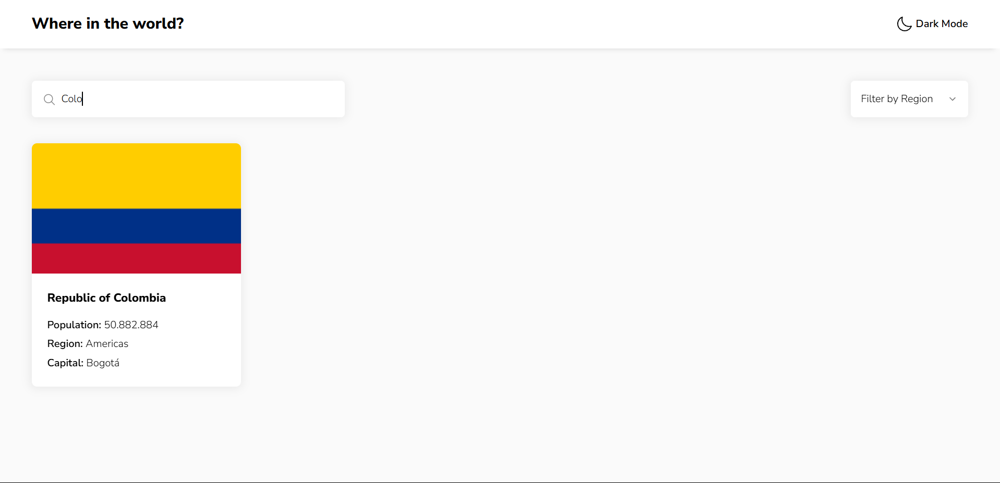
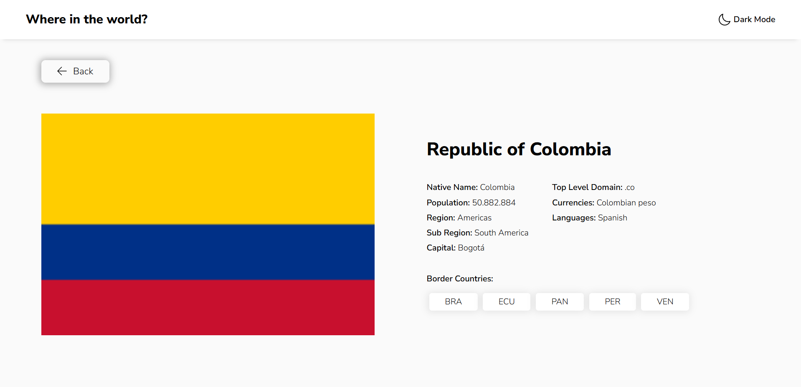
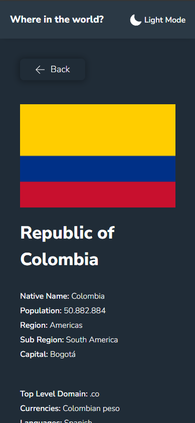

# 🌍 Countries Project

Aplicación web desarrollada con Next.js que permite consultar, filtrar y explorar información detallada sobre países de todo el mundo. Esta herramienta está diseñada para ofrecer una experiencia visual clara, organizada y adaptable a diferentes dispositivos, integrando temas claro y oscuro, navegación fluida y búsqueda interactiva.

Su propósito es facilitar la visualización de datos como nombre del país, población, región, capital, idiomas, monedas, y más, utilizando una interfaz intuitiva y moderna basada en una guía de estilos predefinida.

---

## 🚀 Despliegue

Puedes ver el proyecto funcionando aquí 👉 [Ir al sitio desplegado](https://worldcountriesps.netlify.app/)

---

## ✨ Funcionalidades

- 🔍 Búsqueda por nombre de país
- 🌎 Filtro por región
- 📱 Diseño responsivo
- 🌗 Modo oscuro integrado
- 📄 Detalle de cada país al hacer clic en su bandera
- 🔄 Estado global manejado con Zustand

---

## 🛠️ Tecnologías Utilizadas

- **Framework base**: [Next.js](https://nextjs.org/)
- **Manejador de estado**: [Zustand](https://zustand-demo.pmnd.rs/)
- **Estilos**: CSS modular
- **UI Components**: [shadcn/ui](https://ui.shadcn.com/)
- **Temas**: `next-themes` para soporte de modo claro/oscuro

---

## 🧱 Arquitectura Propuesta

La arquitectura del proyecto está basada en una estructura modular y organizada por responsabilidades, lo que facilita la escalabilidad y el mantenimiento del código.

- **Rutas dinámicas**: Next.js permite renderizar páginas individuales por país mediante `/country/[id]`
- **Componentización**: los elementos visuales están desacoplados y organizados en componentes reutilizables (`ui/`, `general/`)
- **Estilos separados**: se estructuran por tipo (`components`, `pages`, `utilities`) para mantener la limpieza del código
- **Estado centralizado**: utilizando Zustand para manejar los datos globales como la lista de países y filtros

## 📎 Recursos

- 🔗 API: [REST Countries v3.1](https://restcountries.com/)
- 📘 Guía de estilos: incluida en el proyecto como `style-guide.md`

---

## 🚀 Cómo ejecutar el proyecto

1. Clona el repositorio:

   ```bash
   git clone https://github.com/paulasanchezt/countriesproject.git
   ```

2. Accede a la carpeta del proyecto:
   ```bash
   cd countriesproject
   ```
3. Instala las dependencias:
   ```bash
   npm install
   ```
4. Inicia el servidor de desarrollo:
   ```bash
   npm run dev
   ```

---

## 🎨 Vistas del Proyecto

### 🌐 Página principal







### 🌐 Página principal con filtro



### 🌞 Vista del detalle del país 🌙




